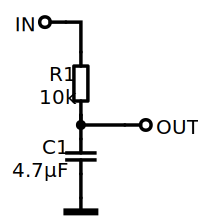
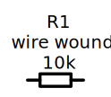

# Koppla

Create electronic schematics in SVG format from readable code.

## Example

```
# Example schematic

<in> - [R1:10k] - |4.7uF| - <gnd>
[R1] - <out>
```



## Getting started

`koppla` is a commandline tool based on Node.js. Developed on version 18, not tested elsewhere.

The easiest way to launch koppla is by using npx:

```console
$ npx koppla -h

usage:
    koppla [options] <input.koppla>

options:
    -output=<output.svg>
    -fontFile=<font.ttf>
    -fontSize=<font size in pixels>
    -watch
    -port=<preview port, defaults to 8080>
```

## Preview server

Use the `-watch` option to launch an auto-reloading preview of the schematic you are working on.
No output file is generated in watch mode.

## Fonts

`koppla` requires a monospace font to function. By default, the included "Inconsolata Regular" is used.

The font is embedded with each generated SVG. Before embedding the font is stripped based on the characters used in the schematic.

## Syntax

### Components


| Component | Designator | Code |
| --- | --- | --- |
| Resistor | R | `- [] -` |
| Capacitor | C | `- \|\| -` |
| Polarized Capacitor | C | `- \|] -` |
| Inductor | L | `- $$ -` |
| Diode | D | `- >\| -` |
| Zener Diode | D | `- >/ - ` |
| Transistor | Q | `- () -` |
| IC | U | `- // -` |
| *Generic* | - | `- ** -` |

The component definition is written between the opening and closing character, for resistors '[' and ']'.
Empty definitions are valid. Components will be given default identities (R1, R2, et.c.) if none is specified.

#### Component definition

A full component definition has four parts:

* Component ID
* Value
* Symbol
* Description

For a resistor:
```
[R12: 47k !symbol "Description"]
```

All parts are optional. Simply specifying a value is fine:

```
|22nF|
```

The unit "ohm" or "o" will produce the ohm symbol, for example `10kohm` yields `10kΩ`

SI prefixes `n` to `G` are supported and the letter `u` will produce the mu symbol: `µ`.

> :warning: The prefix syntax causes units starting with the letter "u" to be misparsed.
    For example the value `42 units` will be interpreted as 42 µnits (micro candela per square meter). Not likely to be a problem in your everyday schematic. :grinning:

If no symbol is specified, the default symbol for the component type is used.
Component ID and value must be separated by a colon if both are specified.

### Ports

There are four kinds of ports:

| Kind | code |
| --- | --- |
| input | `<in>` |
| output | `<out>` |
| supply voltage | `<v>` |
| ground | `<gnd>` |

Multiple ports of a certain kind are supported by adding a specifier, separated by a colon:

```
<v:+22V> - [10ohm "10W"] - <out:supply>
```

### Connections

Connections are made by connecting components with wires. Wires must be delimited by spaces.
Wires are connected to the specified terminal of each component.

In this example, the resistor is connected to the collector of the transistor:

```
[R1] - c(Q1)
```

If no terminal is specified, terminals are chosen based on which side of the component the wire connects to.
A wire on the left hand side connects to the first terminal, and a wire on the right hand side connects to the second.

All ports have one terminal.

> The available terminals are defined by the symbol. A NPN transistor will have the terminals 'c', 'b' and 'e' while a MOSFET will have terminals 'd', 'g' and 's' as expected.

### Comments

Single-line comments use the `#` symbol, and multi-line comments are delimited by `#*` and `*#`.

```
# This is a single line comment

[ R1 ] # And so is this

#*
This whole block is a comment.
[ R1 ]
*#
```

### Component definitions

Component definitions can be provided separately as an alternative or complement to writing
the definitions within the components themselves.

Separate components definitions start with a component ID followed by a colon and one or
more component definition parts.

```
R1: 1k "20W"
C1: "ceramic"
```

Note that each definition overrides earlier definitions part by part:

```
[R1: 10k "plain"]

R1: "wire wound"
```



## Symbols

TBW

## Credits

`koppla` could not have been built without these great components:

* [peggy](https://peggyjs.org/)
* [elkjs](https://github.com/kieler/elkjs)
* [fast-xml-parser](https://github.com/NaturalIntelligence/fast-xml-parser)
* [opentype.js](https://opentype.js.org/)
* [svg-pathdata](https://github.com/nfroidure/svg-pathdata)
* [Inconsolata Font](fonts/README.md)
* [Electric Components Library](symbols/README.md)

## TODO

* Complete main README sections (maybe even this one)
* Add compaction strategy macro setting
* Verify use of generic component
* Add schematic label / legend support
* Make component label / value drawing optional
